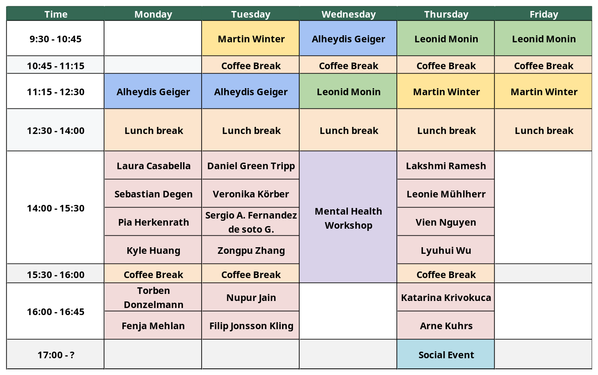
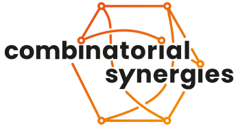

title: Young Researchers Conference on Combinatorial Synergies
date: May 4-8, 2026
location: FU Berlin
---

# Concept

The goal of this conference is to bring together young researchers from the Combinatorial Synergies programme.
Mornings will be dedicated to mini-courses and afternoons to research talks contributed by participants.
We will also have a workshop on the topic of mental well-being in the scope of PhD studies.

Researchers from outside the Combinatorial Synergies program are also welcome to join.

The three mini-courses will be given by:
- [Alheydis Geiger](https://www.mis.mpg.de/people/alheydis-geiger)
- [Leonid Monin](https://people.epfl.ch/leonid.monin?lang=en)
- [Martin Winter](https://martinwintermath.github.io/)

---
# Schedule

The conference will start at 11am on Monday May 4th and will end at lunchtime on Friday May 8th.
Below you may find a *preliminary* schedule:

The schedule is subject to change.

---
# Registration

You may register using [this link.](https://cryptpad.fr/form/#/2/form/view/EF8vYq63qyZQkL21fU0jmPk7Z1PBSTyywDHGFgHLBbI/)

- Registration deadline: March 15th, 2026
- Funding application deadline: Febraury 28th, 2026

*You are **strongly encouraged** to apply for a talk, even if you don't have any results to present. 
The goal of these talks is to give other participants a brief introduction to your research area, and they may be purely expository.*

---
# How to get here

The conference takes place at FU Berlin, in the room A3/019 (Arnimallee 3).
The closest stations are the bus station Arnimallee (bus X83, 5 minutes walk),
U-Bahn Dahlem Dorf (U3, 10 minutes walk) and S-Bahn Botanischer Garten (S1, 20 minutes walk).

---
# Organizers
[Matt Dupraz](https://mattdupraz.github.io/),
[Anna Hofer](https://annahofer00.github.io/),
[Léo Mathis](https://leomathis.wordpress.com/)

In case of questions, please contact us at [yrccs26@lists.fu-berlin.de](mailto:yrccs26@lists.fu-berlin.de).

---

