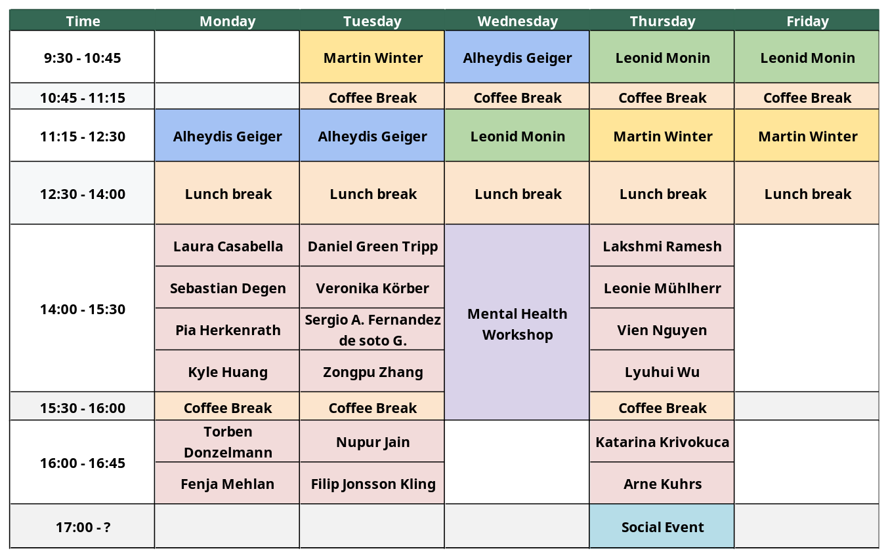
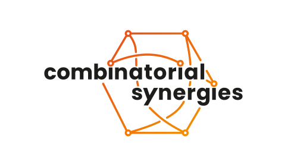

title: Young Researchers Conference on Combinatorial Synergies
date: May 4-8, 2026
location: FU Berlin
---

# Concept

The goal of this conference is to bring together early-career researchers from the Combinatorial Synergies programme.
Mornings will be dedicated to mini-courses and afternoons to research talks contributed by participants.
We will also have a workshop on the topic of mental well-being in the scope of PhD studies.

Researchers and students from outside the Combinatorial Synergies program are also welcome to join.

There are three scheduled mini-courses for the conference:
- [Alheydis Geiger](https://www.mis.mpg.de/people/alheydis-geiger) - Matroids
- [Leonid Monin](https://people.epfl.ch/leonid.monin?lang=en) - Combinatorics of Chow quotients
- [Martin Winter](https://martinwintermath.github.io/) - The Geometry and Combinatorics of Rigidity

### [⇒ Mini-courses abstracts](./mini-courses.html)

---
# Schedule

The conference will start at 11am on Monday May 4th and will end at lunchtime on Friday May 8th.

 

### [⇒ Contributed talks](./talks.html)
---
# Registration

Registrations are now closed.

---
# How to get here

The conference takes place at FU Berlin, in the room A3/019 (Arnimallee 3).

<iframe width="100%" height="350" src="https://www.openstreetmap.org/export/embed.html?bbox=13.29196570032453%2C52.455388264472006%2C13.302104450400824%2C52.45925200982831&amp;layer=transportmap&amp;marker=52.457320179529496%2C13.297035075362714" style="border: 1px solid black"></iframe> <small><a href="https://www.openstreetmap.org/?mlat=52.457320&amp;mlon=13.297035#map=17/52.457320/13.297035&amp;layers=T">View Larger Map</a></small>

## Public transportation

The best connections to the city, depending on where you stay, are the U3 and S1.
The closest stations to the venue
are U-Bahn Dahlem-Dorf (U3, 10 minutes walk) and S-Bahn Botanischer Garten (S1, 20 minutes walk).

If you need to use the S1, you can also take advantage of the bus X83, which leaves from the
S1 station Rathaus Steglitz to reach the bus station Arnimallee (5 mintues walk).
Because of construction work, to use the bus in the other direction, you have to walk to the station
Königin-Luise-Platz/Botanischer Garten (10 minutes walk).

Keep in mind that there are multiple railway stations in Berlin.
If you are arriving to Berlin on Monday, try to arrive at Berlin Südkreuz, it is the closest railway station
to the university. From there you can take the S41 to Heidelberger Platz and then the U3 to Dahlem-Dorf.
If you arrive to Berlin Hauptbahnhof, you can either first take a train to Südkreuz and then use the above
route, or you can take S5/7/9 to Zoologischer Garten, then U9 to Spichernstraße, and finally U3 to
Dahlem-Dorf.

Please take note
that the U3 only runs between Krumme Lanke and Spichernstraße. Beyond Spichernstraße (east-bound)
you will have to change to a replacement service.
For more information check [the notice on the BVG website](https://www.bvg.de/en/connections/route-overview/u3#disruptions).

You may visit the [BVG website](https://www.bvg.de/en) for a transportation map and information about ticketing.

## Hotels

You might find it difficult to find a hotel near the university if you are on a budget.
We recommend to search for hotels in areas that are easy to reach via the U3 (keep in mind the above mentioned 
replacement service on the U3). For example, there are various
options near the U-Bahn station Adenauerplatz (25 minutes via U3+U7).

---
# Organizers
[Matt Dupraz](https://mattdupraz.github.io/),
[Anna Hofer](https://annahofer00.github.io/),
[Léo Mathis](https://leomathis.wordpress.com/)

In case of questions, please contact us at [yrccs26@lists.fu-berlin.de](mailto:yrccs26@lists.fu-berlin.de).

---

